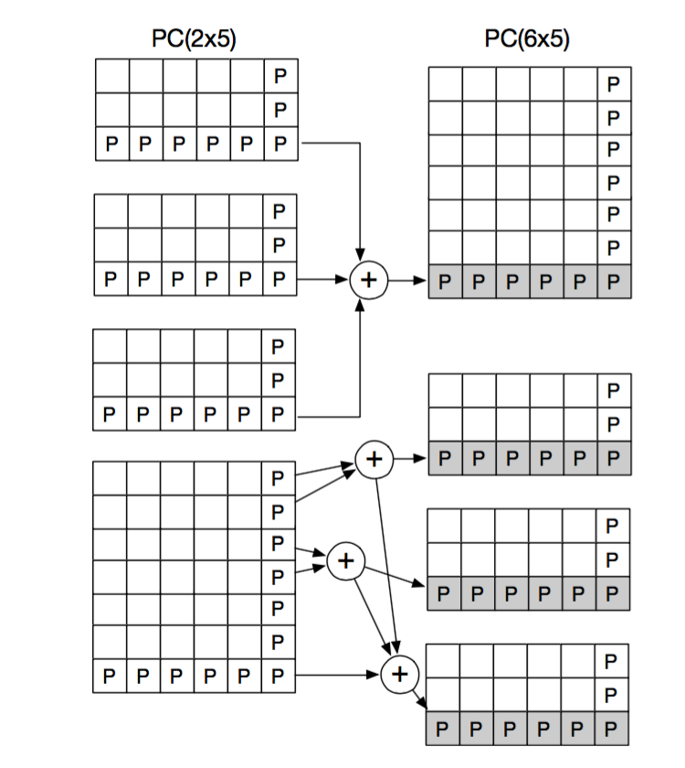
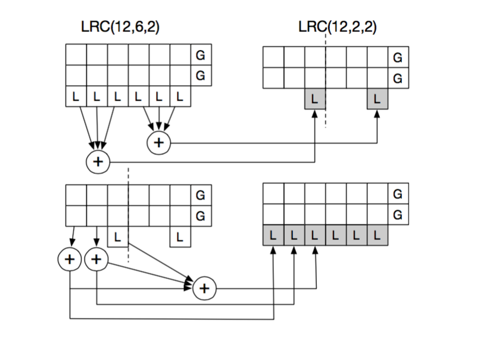

# A Tale of Two Erasure Codes in HDFS
[论文详见](https://github.com/yihuaijiereal/Note/blob/master/FAST/Two%20Erasure%20Codes.pdf)
## 1.摘要
这篇文章介绍了一个新的使用纠删码的存储系统HACFS，与一般系统不同的是，它使用两种不同的纠删码来动态的适应负载的变化。它使用一个快速编码来优化恢复时的性能，使用一个压缩编码来减少存储消耗。大多数系统使用单一的纠删码，比如谷歌的ColossusFS使用的RS（6，3）、Facebook的HDFS的RS（10，4）和微软的Azure的LRC，来优化存储空间的消耗，但是这会带来恢复期间大量的数据读和传输，这就导致了两个严重的问题：高度的读延迟和更长的数据重建时间。HACFS使用快速编码来编码一小部分经常访问的数据，是的总体上的恢复消耗较低；使用压缩编码大部分的访问较少的数据块来获得较低的存储开销。

在大多数的HDFS系统中98%的失效恢复只需要恢复一个数据块，所以大所属的纠删码存储系统都将重点发在了减少单个数据块的失效恢复的开销上。
## 2.HACFS的设计目标
    1)快速的下降读，在访问丢失的数据和不可用的数据的时候，降低读的延迟。
    2)降低数据重建时的时间和网络带宽。
    3)低存储开销，提供低的存储开销，并且能根据负载情况调整。
## 3.系统设计
提供encode，decode，upcode，downcode接口。前两个用来编解码，upcode将快速编码转换到压缩编码的，downcode相反。刚刚写入的时候采用三副本策略，写完以后，当不是读热点的时候，采用压缩码，是读热点的时候用快速码。二者之间可以转换。
### 3.1.product code

快速编码：PC（2x5），
生成5个垂直的P块和2个横向的p块，以及一个全局块。每个横向块需要读取横向的5个数据块来XOR，每个垂直需要垂直方向的两个数据块，全局块需要将两个横向块XOR。

压缩编码：PC（6x5），
生成5个垂直的P块和6个横向的p块，以及一个全局块。每个横向块需要读取横向的5个数据块来XOR，每个垂直需要垂直方向的6个数据块，全局块需要将6个横向块XOR。

upcode：
将三个快速码的垂直P块XOR，全局块也是如此。横向块不变。

downcode：前两个快速码的垂直P块和全局块分别由数据块生成。最后一个由压缩码的P块和前两个的P快XOR成。横向不变。

### 3.2.LRC

